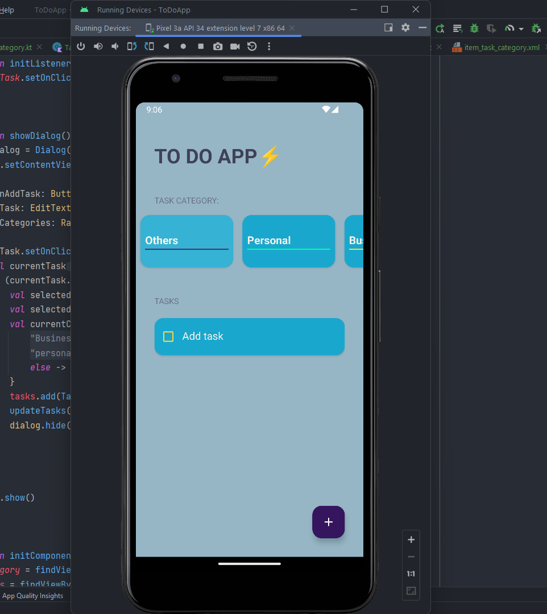
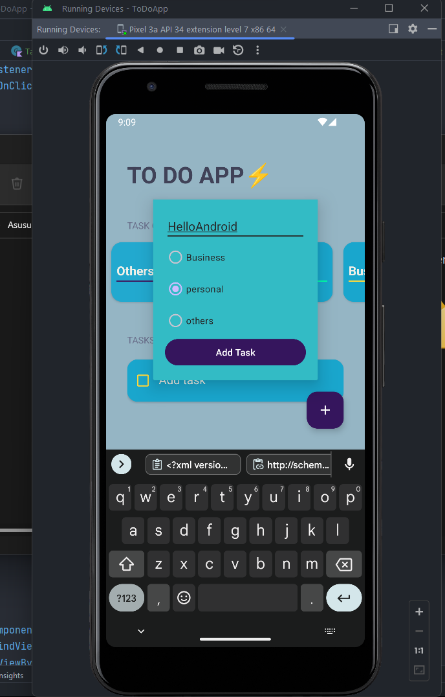
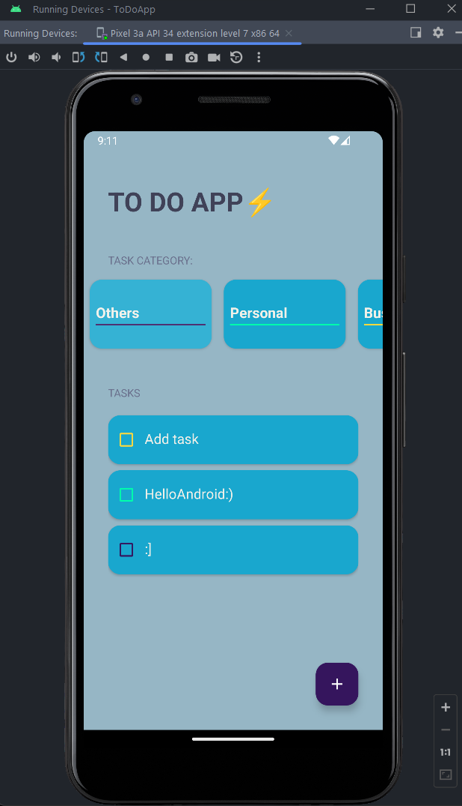

# ToDo App

La aplicación "ToDo" es una herramienta para gestionar tareas y mantener un seguimiento de tus actividades pendientes. La interfaz de usuario es sencilla y eficiente, lo que la hace ideal para llevar un registro de tus tareas diarias, clasificándolas en diferentes categorías.

## Funcionalidades Principales

- **Pantalla Principal:** Al iniciar la aplicación, se muestra la pantalla principal con un título llamativo y un subtítulo. Además, hay tres categorías disponibles: "Personal", "Negocios" y "Otros". Estas categorías permiten organizar las tareas de acuerdo a su naturaleza.

- **Categorías de Tareas:** Las categorías se presentan en forma de tarjetas en la parte superior de la pantalla principal. Al hacer clic en una categoría, la aplicación filtra y muestra solo las tareas asociadas a esa categoría.

- **Lista de Tareas:** Justo debajo de las categorías, se muestra la lista de tareas pendientes. Cada tarea tiene un checkbox para marcarla como completada y un texto descriptivo.

- **Agregar Tareas:** Al hacer clic en el botón de "Agregar Tarea" (un ícono de suma), se abre un cuadro de diálogo emergente. Aquí puedes ingresar una nueva tarea y seleccionar su categoría. Después de agregar la tarea, se actualiza la lista de tareas.

- **Marcado de Tareas:** Puedes marcar una tarea como completada o pendiente simplemente marcando o desmarcando el checkbox junto a la tarea. Las tareas completadas pueden ser tachadas para indicar su estado.

## Capturas de Pantalla

  
  
  

  
## Requisitos de Instalación

Para probar la aplicación en tu entorno de desarrollo, sigue estos pasos:

1. Clona este repositorio en tu máquina local.
2. Abre el proyecto en Android Studio.
3. Compila y ejecuta la aplicación en un emulador o dispositivo Android.

## Contribución

Si deseas contribuir a este proyecto, ¡serán bienvenidas tus contribuciones! Puedes realizar mejoras, corregir errores o agregar nuevas funcionalidades. Sigue estos pasos para contribuir:

1. Haz un fork de este repositorio.
2. Crea una rama para tu nueva función (`git checkout -b nueva-funcion`).
3. Realiza tus cambios y commitea (`git commit -m "Agregada nueva función"`).
4. Envía tus cambios a tu fork (`git push origin nueva-funcion`).
5. Crea un pull request en este repositorio.

## Licencia

Este proyecto está bajo la Licencia [MIT](LICENSE).

---

¡Disfruta utilizando la aplicación de ToDo! Si tienes alguna pregunta o problema, no dudes en abrir un issue en este repositorio.

